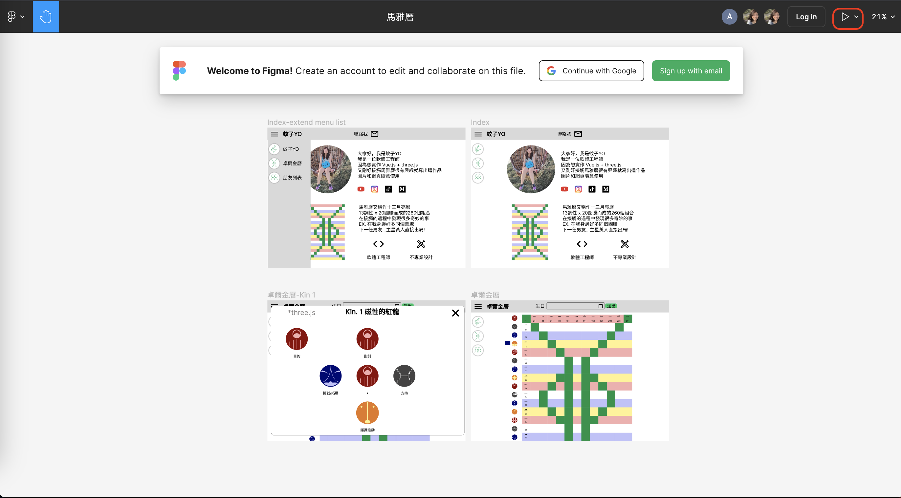
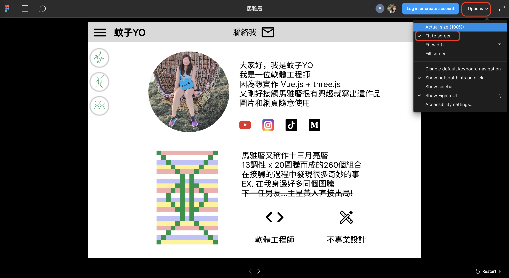
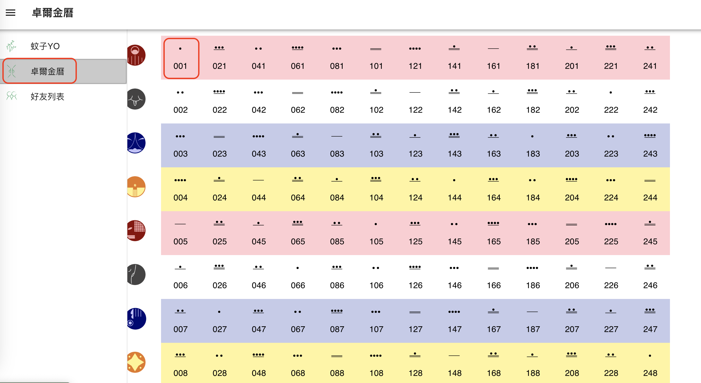
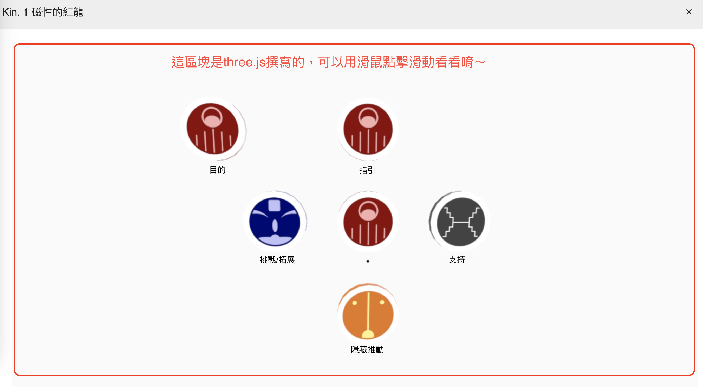

# 馬雅曆 十三月亮曆
### 是一套以不同曆法與年鑑所組成的系統，用20個圖騰和13個調性的260個組合成的星系組合，每個圖騰都有其意義，因為是用260天來計算，所以計算時會發現，每隔4年一般日曆的生日會和馬雅曆生日主星圖騰一樣，然後因為13年會重新輪一次調性，52歲的時候會剛好一般日曆生日等於馬雅曆生日，所以啊，一年只過一次生日嗎？不！還有馬雅曆生日，一年有兩次生日趴不錯吧～可以許兩次願望欸!
## 開啟終端機並於該資料夾底下進行安裝動作
```
> npm install
> npx vite
```

## 目的
### 前端 Vue3.js 套件 three.js、lodash.js 設計框架 vuetify.js，使用套件跟設計框架可以更快速的呈現我想要的結果。
### 本來我是想跟新認識的朋友，他學了兩年馬雅曆且想推廣馬雅曆，他說網路上的網頁有些功能沒有很完整，app也是如果不持續更新，系統更新後很多都不能使用了，所以才跟我討論想要一些功能比較方便，在他講解的時候我有感覺很特別滿好玩的，覺得跟他很有緣便答應他一起撰寫這個網頁，初次討論的時候他很積極的講出想要的網頁功能，也希望網頁可以有他的元素在，所以我就請他畫圖騰跟調性，結果後來就沒下文了，很可惜少了一位已經有經驗的人協助，但我也把跟他討論當天跟我說的內容統整後，將這個題材作為我的作品集之一。
### 以前公司使用Vue2.js，未使用過three.js，所以就來挑戰看看，才有現在的作品，之後會持續更新把一些功能補上，一些馬雅曆的計算方式跟three.js的使用也要多熟悉。

## 設計圖
### 我用Figma來設計我的整體網頁呈現方式，所有圖片除了前端框架Vuetify的icon以外，都是我自己用 Adobe Illustrator 繪製的向量圖，歡迎直接拿去使用，我不是專業設計就請多多包涵吧。
### <a href="https://www.figma.com/file/s1v5euWlCxhUJMXb2tfNqk/%E9%A6%AC%E9%9B%85%E6%9B%86?type=design&node-id=0%3A1&mode=design&t=4o26YzvjmcWN8GN8-1" >Figma 設計圖連結</a>

### 點擊右上角啟動icon可以預覽流程


### 右上角Options選擇fit to screen就可以預覽完整的圖片


## three.js 使用
### 可直接點擊左側按鈕，選擇卓爾金曆，點擊隨便一個圖騰搭配的調性就會跳出視窗，還在看怎麼用生日計算出自己的馬雅生日圖


### 右上角X可以關閉視窗，這邊可以直接滑鼠游標點著滑動唷～未來會在看怎麼設計說明文字在上方，還在學習three.js中，另外馬雅曆還有合盤，就會有兩三組馬雅曆在同個視窗裡面，可以用滑鼠放大縮小跟移動，這樣就不用開開關關很麻煩了
# maya_calendar
